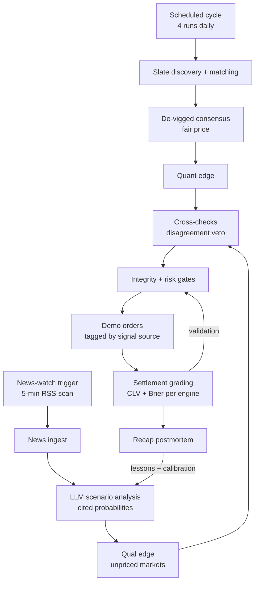

# Kalshi Scenario Bot

**An autonomous, two-engine trading system for Kalshi sports prediction markets** — it prices every open sports contract against sharp-sportsbook consensus *and* an LLM news analyst, trades the differences on Kalshi's demo exchange, grades every settled outcome, and uses that evidence to earn its way toward real-money trading through hard validation gates.

Package `nbabot`, CLI `ksobot` (the legacy `nbabot` command remains as an alias).

> **Design constitution:** LLMs research on a schedule and produce numbers. Deterministic, tested code does all the trading. There is no AI in the execution path — ever.

---

## What it does, in one pass

Kalshi lists sports contracts that trade between 1¢ and 99¢, where price ≈ probability. The bot's entire job is answering one question, hundreds of times a day: **is Kalshi's price wrong, and by enough to bet on?** It answers with two independent engines and a shared, gated executor:



---

## The two engines

### 1. Quantitative engine — sportsbook consensus

There is no invented model; the "fair price" is the sharpest free estimate on earth, cleaned up:

- **Slate discovery** pulls every open Kalshi sports market (~200 candidates per run).
- **Identity matching** pairs each Kalshi contract with the *same bet* at real sportsbooks — team, market type, line, side, date. Handles MLB doubleheaders, team aliases, and Kalshi's `floor_strike` spread encoding. Fuzzy matches are **permanently barred from trading**.
- **De-vigged consensus** strips bookmaker margin (Shin's method + power method), weights sharp books (Pinnacle, Circa) above soft ones, drops outliers and dedupes across three odds providers (SportsGameOdds, The Odds API, ParlayAPI).
- **Edge** = fair probability − Kalshi price, measured against a **dynamic required edge** that rises with uncertainty: thin book coverage, book disagreement, and wide Kalshi spreads all raise the bar. Well-covered liquid markets need ~5%; thin disputed ones need up to ~15%.

### 2. Qualitative engine — LLM news analyst

Roughly 80 of 200 Kalshi markets have no sportsbook equivalent — consensus can't price them at all. The qual engine exists for exactly those, plus information the consensus hasn't absorbed yet:

- **Team-scoped ingestion**: RSS from MLB.com team feeds, ESPN, and team subreddits for configured focus teams (currently Yankees, Mets, Tigers), deduplicated into SQLite. Every source fails independently.
- **Scenario analysis**: a scheduled LLM pass (the local Codex CLI, swappable via one env var) reads recent team news and must return **strict JSON**: probability decomposed into **scenario branches** ("ace pitches 70% → win 58% / scratched 30% → win 44%") that must mathematically reconcile to the point estimate, plus confidence and **citations to specific news items**. Uncited, unconfident, or hallucinated-ticker signals are discarded automatically.
- **Fail-soft by construction**: if the LLM is down or quota-blocked, the cycle records `qual unavailable`, continues consensus-only, and says so in its report. The trading loop can never crash because research failed.
- Qual-priced trades pay a **novelty premium** (higher edge floor) and are **hard-blocked from live** until proven.

### Cross-engine checks

- **Disagreement veto**: a confident qual signal that opposes a consensus edge by 8+ points (the classic "consensus hasn't seen the injury yet") blocks the trade — and the vetoed trade is saved as a **shadow record graded counterfactually** at settlement, so the data proves whether the vetoes save money.
- Every trade is tagged with its **signal source** end-to-end, so the engines build fully separate track records that never contaminate each other.

---

## Event-driven trading

Four scheduled cycles a day, plus a **news-watch** every 5 minutes (cheap RSS diff, no LLM) scanning for high-impact keywords — *scratched, injured, IL, suspended, postponed, lineup change*. A hit fires an immediate full cycle for the affected team, debounced (45 min/team, 8 triggers/day). This chases the real qualitative edge: the minutes between news breaking and Kalshi repricing.

---

## The learning loop

Every settled trade is graded three ways:

| Metric | Question it answers |
|---|---|
| **Outcome** | Did it win? |
| **Closing line value (CLV)** | Did we beat the closing price — skill, or luck? |
| **Brier score** | Were our probabilities accurate? |

- The **performance learner** aggregates per market family *and per signal engine*, and is the sole authority that marks a family **validated for live trading**.
- The **postmortem pass** (qual trades) fetches the game recap after settlement, identifies *which scenario branch actually happened*, and grades the event forecast separately from the conditional — so a wrong probability is debuggable, not just wrong. Deduplicated **lessons** and hard per-bucket **calibration lines** ("your 60% calls hit 52% over 23 trades") are injected into every future analysis prompt. The analyst reads its own report card before each new take.

---

## Execution modes and safety

Three modes share one risk-evaluation path:

| Mode | What it is | Gate |
|---|---|---|
| `paper` | Simulated fills, pure bookkeeping | Default mode |
| `demo` | **Real orders on Kalshi's demo exchange**, signed with dedicated demo credentials that can never silently fall back to the production key | `NBABOT_EXECUTION_MODE=demo` + demo credentials |
| `live` | Real money | Four explicit env acknowledgments **plus** per-family validation: n ≥ 100 settled trades, 60%+ CLV beat rate, Brier better than baseline |

```bash
# Live requires ALL of these, deliberately set by a human:
NBABOT_EXECUTION_MODE=live
NBABOT_DRY_RUN=0
NBABOT_LIVE_TRADING_ACK=LIVE_TRADES_REAL_MONEY
NBABOT_BROAD_SLATE_EXECUTION=BROAD_SLATE_TRADES_REAL_MONEY
```

**Integrity gates apply in every mode** (they protect the meaning of the data, not money): fuzzy identity matches never trade, implausible edges (>15% — almost always a data bug) are quarantined, composite/multi-leg markets are blocked, and `data/KILL_SWITCH` halts everything. Position sizing is quarter-Kelly throughout. Daily caps, per-game and daily-loss exposure limits, stale-quote rejection, and spread caps ride on top. Every order flows through SQLite + JSONL ledgers + an audit log.

Demo currently runs in deliberate **data-collection mode** (lowered edge floors, raised caps) to accumulate the settled-trade corpus the validation gates require.

---

## Quickstart

```bash
python -m venv .venv && source .venv/bin/activate
pip install -e .
cp .env.example .env
# Fill in: KALSHI_API_KEY + secrets/kalshi-private-key.txt (production, read-only use)
#          KALSHI_DEMO_API_KEY + secrets/kalshi-demo-private-key.txt (demo trading)
#          THE_ODDS_API_KEY / SPORTSGAMEODDS_API_KEY / PARLAY_API_KEY (odds providers)
#          NBABOT_TELEGRAM_BOT_TOKEN / NBABOT_TELEGRAM_CHAT_ID (run reports)

ksobot daily-cycle            # one full pipeline pass
ksobot status                 # operating state, blockers, orders
ksobot ui                     # local dashboard at http://127.0.0.1:8765
```

### Run it unattended

One crontab covers everything — four daily demo cycles plus the 5-minute news-watch:

```bash
crontab scheduler/combined-crontab.txt
caffeinate -s   # keep a Mac awake during scheduled windows
```

Each cycle runs discovery → news → qual analysis → matching → ranking → execution → settlement audit → status, then sends one concise Telegram report (including errors — the bot tells you when it's stuck).

---

## CLI reference

Pipeline phases (each writes a JSON artifact under `data/` and mirrors to `data/research.sqlite`):

```bash
ksobot slate-discovery        # find open Kalshi sports markets + provider odds
ksobot slate-verify           # reject unmapped/social-only findings
ksobot news-ingest            # team RSS/Atom into SQLite (fail-soft per source)
ksobot qual-research          # LLM scenario analysis for consensus-less markets
ksobot news-watch             # 5-min keyword scan; triggers cycles on breaking news
ksobot market-matcher         # orderbook deltas + execution-review slate
ksobot candidate-ranker       # de-vigged consensus edge + blockers per market
ksobot research-agent         # evidence bundle + trade-eligible handoff
ksobot paper                  # simulated fills
ksobot demo-execute           # real Kalshi demo orders (demo mode + demo creds)
ksobot live-execute           # real money; requires all live gates
ksobot settlement-audit       # resolve outcomes, compute CLV/Brier
ksobot qual-postmortem        # recap-based grading of settled qual trades
ksobot daily-cycle            # the full activation chain, one command
ksobot scheduled-demo-cycle   # daily-cycle + settlement + Telegram report
ksobot portfolio-sync         # mirror Kalshi balance/positions locally
ksobot source-check           # provider readiness (network probes opt-in)
ksobot telegram-test          # verify alert delivery
ksobot status | ksobot ui     # state summary / browser dashboard
```

A legacy single-game NBA scenario engine (`baseline` / `lineups` / `lock` / `heartbeat` / `reconcile`, plus `backtest` and YAML game configs under `config/`) remains functional — see `docs/platform-roadmap.md` and `ksobot ports` for the sport-adapter architecture.

---

## Key configuration

Everything is environment-driven (`.env` is parsed natively; real env vars win). The load-bearing knobs:

```bash
# Engines
NBABOT_MIN_EDGE=0.05                  # live consensus floor (never lowered)
NBABOT_DEMO_MIN_EDGE=0.03             # demo/paper consensus floor
NBABOT_QUAL_MIN_EDGE=0.06             # qual novelty premium
NBABOT_QUAL_LLM_CMD="~/.codex/plugins/.plugin-appserver/codex exec"
NBABOT_RESEARCH_TEAMS=config/research_teams.yaml
NBABOT_NEWS_WINDOW_HOURS=48

# Cross-checks + triggers
NBABOT_CONFLUENCE_VETO_DELTA=0.08
NBABOT_EVENT_TRIGGER_COOLDOWN_MINUTES=45
NBABOT_EVENT_TRIGGER_DAILY_CAP=8

# Volume + risk backstops
NBABOT_PAPER_DEMO_DAILY_TRADE_CAP=50
NBABOT_QUAL_DAILY_TRADE_CAP=10
NBABOT_MAX_DAILY_LOSS_UNITS=2
NBABOT_MAX_GAME_EXPOSURE_UNITS=5
NBABOT_MAX_PLAUSIBLE_EDGE=0.15        # >15% "edge" = probably a data bug
NBABOT_STALE_MARKET_SECONDS=90
NBABOT_MAX_SPREAD_CENTS=10
NBABOT_KILL_SWITCH=data/KILL_SWITCH

# Providers
SPORTSGAMEODDS_API_KEY= / THE_ODDS_API_KEY= / PARLAY_API_KEY=
NBABOT_SLATE_SPORTS=mlb               # comma-separated sports for the slate
```

A narrow, audit-friendly **research override** exists for human-approved theses (named approver, 80+ char evidence-based reason, 2+ sources, ≤1 unit) — it bends the minimum-edge check only; every other gate still applies.

---

## Roadmap (in active development)

- **Fee-adjusted edges** — every threshold compared against net edge after Kalshi's price-dependent fee curve, with maker orders as default
- **Bidirectional activation** — news triggers price a targeted market basket; near-miss quant edges get a qual investigation, upgrading to a distinct `qual_activated_quant` signal type with a full evidence chain
- **Claude API failsafe** — when the primary LLM engine is quota-blocked, analysis reroutes through the Anthropic API, with every signal tagged by engine so grading compares the two analysts

The full build history — every phase, verified with real data, honestly logged including the failures — is in `docs/edge-engine-progress.md`.

## For agents continuing this repo

Read **`AGENTS.md`** first. It has the data contracts, the honesty contract you must not weaken, and the extension points. The short version: verify against real behavior, never fabricate results, never touch the live gates, and pure modules (`market_identity.py`, `odds_math.py`, `edge_engine.py`) stay network-free.

---
*Bet only what you can lose. NY help: 877-8-HOPENY / text HOPENY (467369).*
